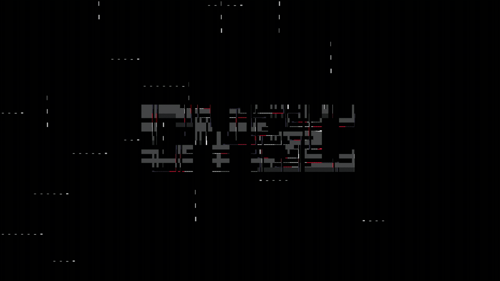
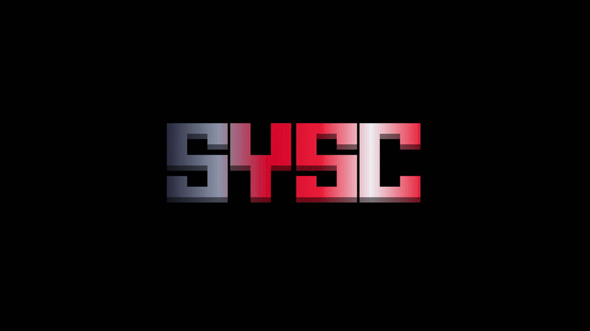

# sysc-Go

Terminal animation library for Go. Pure Go animations ready to use in your TUI applications.


## Effects

### Animations
Standalone effects that don't require text input.

- **Fire** - DOOM PSX-style fire animation
- **Matrix Rain** - Classic Matrix digital rain
- **Rain** - ASCII character rain effect
- **Fireworks** - Particle-based fireworks display
- **Beams** - Full-screen light beam background animation
- **Aquarium** - Underwater scene with fish, diver, boat, and sea life

### Text Effects
Effects that animate ASCII text and art (requires `-file` flag).

- **Fire Text** - ASCII text consumed by rising flames
- **Matrix Art** - ASCII art with Matrix-style digital streams
- **Rain Art** - ASCII art with crystallizing rain effect
- **Pour** - Characters pour into position from different directions
- **Print** - Typewriter-style text rendering
- **Beam Text** - Text display with animated light beams and auto-sizing
- **Ring Text** - Text rotates and converges in spectacular ring animation
- **Blackhole** - Text gets consumed by a swirling blackhole and explodes

## Installation

### CLI Tools

**Via one-line installer (fastest):**
```bash
curl -fsSL https://raw.githubusercontent.com/Nomadcxx/sysc-Go/master/install.sh | sudo bash
```

**Via interactive installer:**
```bash
# Clone and run the TUI installer (requires sudo for system-wide installation)
# Installs both syscgo and syscgo-tui binaries
git clone https://github.com/Nomadcxx/sysc-Go.git
cd sysc-Go
sudo go run ./cmd/installer/
```

**Via AUR (Arch Linux):**
```bash
yay -S syscgo
```

**Via Go:**
```bash
go install github.com/Nomadcxx/sysc-Go/cmd/syscgo@latest
go install github.com/Nomadcxx/sysc-Go/cmd/syscgo-tui@latest
```

### As Library

```bash
go get github.com/Nomadcxx/sysc-Go
```

## Quick Start

### Interactive TUI

The easiest way to browse and select animations is through the interactive TUI:

```bash
syscgo-tui
```


**Features:**
- Visual selector for all animations, themes, and durations
- Built-in ASCII art editor (BIT) with live preview
- 174 block-style fonts for creating ASCII art
- Real-time animation preview
- Export ASCII art to file (Ctrl+S)
- Navigate with arrow keys or vim keybindings (h/j/k/l)
- Instant theme switching

### Command Line

Run any animation directly from command line:

**Animations** (no text input required):
```bash
# Fire effect with Dracula theme (infinite loop)
syscgo -effect fire -theme dracula -duration 0

# Matrix rain with Nord theme for 30 seconds
syscgo -effect matrix -theme nord -duration 30

# Rain effect with Tokyo Night theme
syscgo -effect rain -theme tokyo-night

# Fireworks display
syscgo -effect fireworks -theme catppuccin -duration 20

# Beams effect (full-screen background)
syscgo -effect beams -theme nord -duration 0

# Aquarium effect (infinite)
syscgo -effect aquarium -theme dracula -duration 0
```

**Text Effects** (require `-file` flag with text/ASCII art):
```bash
# Fire text effect with ASCII art
syscgo -effect fire-text -file logo.txt -theme rama -duration 0

# Matrix art effect
syscgo -effect matrix-art -file art.txt -theme eldritch -duration 20

# Rain art effect
syscgo -effect rain-art -file banner.txt -theme tokyo-night -duration 15

# Pour effect with text file
syscgo -effect pour -file message.txt -theme gruvbox -duration 10

# Print effect (typewriter style)
syscgo -effect print -file banner.txt -theme catppuccin -duration 15

# Beam text effect with auto-sizing and display mode
syscgo -effect beam-text -file header.txt -auto -display -theme nord -duration 5

# Ring text effect
syscgo -effect ring-text -file title.txt -theme eldritch -duration 10

# Blackhole effect with text
syscgo -effect blackhole -file text.txt -theme dark -duration 15
```

**Available themes:** dracula, gruvbox, nord, tokyo-night, catppuccin, material, solarized, monochrome, transishardjob, rama, eldritch, dark

**Text Effect Flags:**
- `-auto` - Auto-size canvas to fit text (beam-text only)
- `-display` - Complete once and hold at final state (beam-text only)
- `-file` - Path to text file for text-based effects

## Effect Showcase

### Animations

#### Fire


#### Matrix Rain


#### Rain


#### Fireworks


#### Beams


#### Aquarium


### Text Effects

#### Fire Text


#### Matrix Art


#### Rain Art


#### Beam Text


#### Ring Text


#### Blackhole


## Demo

Run the interactive demo to see all animations:

```bash
cd examples/demo
go run .
```

## Documentation

See [GUIDE.md](GUIDE.md) for detailed CLI usage.

## Acknowledgements

- [terminaltexteffects](https://github.com/ChrisBuilds/terminaltexteffects) - Inspiration for terminal visual effects
- [bit](https://github.com/superstarryeyes/bit) - ASCII art editor and font library integration

## License

MIT