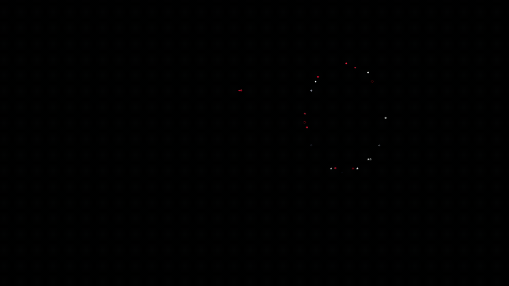
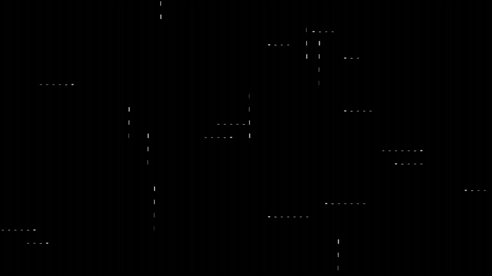

Terminal animation library for Go. Pure Go animations ready to use in your TUI applications.

## Features

- **Rain Effect** - ASCII character rain effect
- **Matrix Rain** - Classic Matrix digital rain
- **Fireworks** - Particle-based fireworks display
- **Fire Effect** - DOOM PSX-style fire animation
- **Pour Effect** - Characters pour into position from different directions
- **Beams Effect** - Full-screen light beam background animation
- **Beam Text Effect** - Text display with animated light beams and auto-sizing
- **Ring Text Effect** - Text rotates and converges in spectacular ring animation
- **Blackhole Effect** - Text gets consumed by a swirling blackhole and explodes
- **Blackhole Particles** - Pure particle blackhole effect with random stars (no text)
- **Aquarium** - Underwater scene with fish, diver, boat, and sea life
- **Print Effect** - Typewriter-style text rendering
- **Rain Art** - ASCII art with crystallizing rain effect
- **Matrix Art** - ASCII art with Matrix-style digital streams

## Installation

### CLI Tool

**Via interactive installer (recommended):**
```bash
# Clone and run the TUI installer (requires sudo for system-wide installation)
git clone https://github.com/Nomadcxx/sysc-Go.git
cd sysc-Go
sudo go run ./cmd/installer/
```

**Via AUR (Arch Linux):**
```bash
yay -S syscgo
```

**Via Go:**
```bash
go install github.com/Nomadcxx/sysc-Go/cmd/syscgo@latest
```

### As Library

```bash
go get github.com/Nomadcxx/sysc-Go
```

## Quick Start

Run any animation directly from command line:

```bash
# Rain effect with Tokyo Night theme
syscgo -effect rain -theme tokyo-night

# Matrix rain with Nord theme for 30 seconds
syscgo -effect matrix -theme nord -duration 30

# Fire effect with Dracula theme (infinite loop)
syscgo -effect fire -theme dracula -duration 0

# Pour effect with Tokyo Night theme
syscgo -effect pour -theme tokyo-night -duration 10

# Beams effect with Nord theme (full-screen background)
syscgo -effect beams -theme nord -duration 0

# Beam text effect with auto-sizing and display mode (perfect for .zshrc)
syscgo -effect beam-text -theme nord -file message.txt -auto -display -duration 5

# Aquarium effect with Dracula theme (infinite)
syscgo -effect aquarium -theme dracula -duration 0

# Blackhole particles effect with Eldritch theme (dramatic full-screen particle animation)
syscgo -effect blackhole-particles -theme eldritch -duration 0
```

**Available themes:** dracula, gruvbox, nord, tokyo-night, catppuccin, material, solarized, monochrome, transishardjob, rama, eldritch, dark

### Beam Text Special Flags

The `beam-text` effect supports two special flags:

- **`-auto`** - Automatically sizes the canvas to fit text dimensions exactly
- **`-display`** - Completes animation once and holds at final bright state (perfect for `.zshrc`)

Example for `.zshrc` startup animation:
```bash
syscgo -effect beam-text -file ~/header.txt -auto -display -theme nord -duration 5
```

This will animate your text, complete the full beam animation cycle, and hold at the final bright state before continuing shell startup.

## Effect Showcase

### Rain


### Matrix


### Fireworks


### Fire


### Decrypt


### Pour


### Beams


### Beam Text


### Aquarium


### Print


## Demo

Run the interactive demo to see all animations:

```bash
cd examples/demo
go run .
```

## Documentation

See [GUIDE.md](GUIDE.md) for detailed usage.

## Inspiration

This project was inspired by [terminaltexteffects](https://github.com/ChrisBuilds/terminaltexteffects) - an amazing Python library for terminal visual effects. sysc-Go brings similar visual effects to the Go ecosystem with a focus on performance and easy integration into Go TUI applications.

## License

MIT